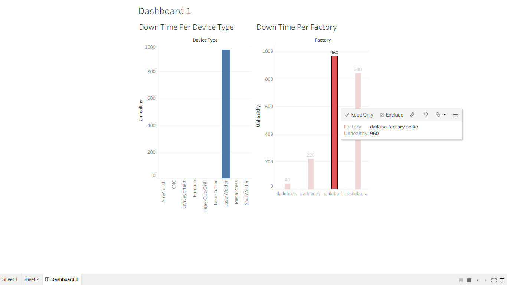

# Data Analytics Project

## Project 1: Equality Analysis Dashboard
Tools Used: Tableau, Excel
### Objective
Analyze employee compensation equality scores and identify fairness across factories and job roles.
### Dashboard Preview
![Equality Dashboard](Equality Dashboard.png

## Project 2: Machine Downtime Analysis
Tools Used: Tableau, Excel
### Objective
Analyze machine downtime patterns and identify operational inefficiencies.
### Dashboard Preview

---

## Skills Demonstrated
- Data Cleaning
- Data Analysis
- Tableau Dashboard Development
- Data Visualization
- Business Insights
